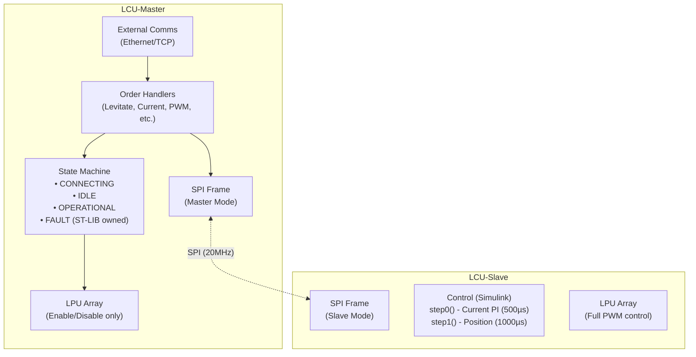
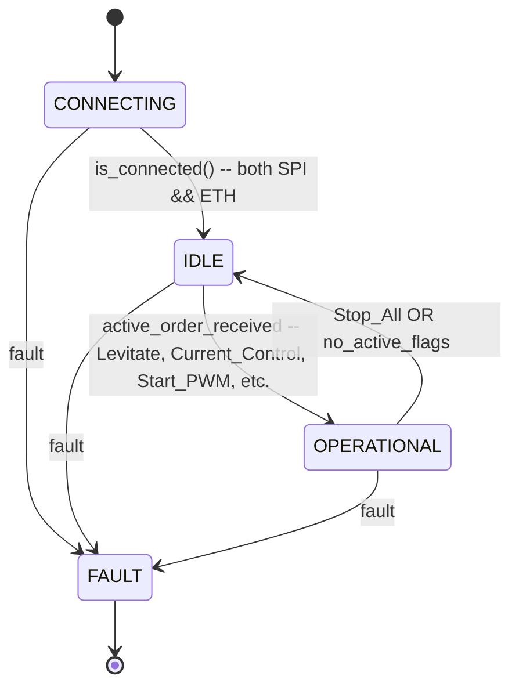

# LCU-Master Architecture

## Overview

The Levitation Control Unit (LCU) consists of two microcontrollers:
- **Master MCU** (this firmware): Owns external communications (Ethernet/TCP) and coordinates the system
- **Slave MCU** (LCU-Slave-H11): Owns hardware I/O, sensors, and control algorithms

Communication from external control station arrives via Ethernet/TCP. Master processes orders and forwards commands to Slave via SPI.

## Architecture Summary



**Note:** Master does NOT have Levitation, Current Control, or Debug modes. Master simply:
1. Receives orders from external control station
2. Sets command flags and parameters in SPI frame for Slave
3. Enables/disables LPUs when Slave transitions to active modes (OPERATIONAL state)
4. The actual control algorithms run on the Slave

## State Machine



**Note:** Master uses a **flat** state machine (no nesting). The key insight is:
- Master is OPERATIONAL when the **Slave** is in any active mode (Levitation, Current Control, or Debug)
- Master doesn't have its own active modes - it just enables LPUs when the Slave needs them
- `slave_state` comes from the SPI StatusPacket received from Slave

### State Details

| State           | Enter Action              | Exit Action               | Cyclic Action              | Frequency |
| --------------- | ------------------------ | ------------------------ | -------------------------- | --------- |
| CONNECTING      | Toggle LED               | -                        | Check SPI + ETH connection | 500ms     |
| IDLE            | -                        | -                        | Update LPUs, check faults  | 1ms       |
| OPERATIONAL     | Enable all LPUs          | Disable all LPUs         | Update LPUs, check faults  | 1ms       |
| FAULT           | Turn on fault LED, disable LPUs | -            | Emergency shutdown         | -         |

### Transition Logic

Transitions are driven by **orders received from Ethernet**, not by `slave_state`:
- `CONNECTING → IDLE`: when `is_connected()` returns true (both SPI and ETH connected)
- `IDLE → OPERATIONAL`: when any active order is received (Levitate, Current_Control, Start_PWM, Enable_Buffer, etc.)
- `OPERATIONAL → IDLE`: when `Stop_All` is received or no active command flags remain

**Key Insight:** The `slave_state` received from Slave is a *consequence* of Master's commands, not a *cause* of Master's state transitions. Master enables LPUs at the same time it sends commands to Slave, not after waiting for Slave to confirm.

### Fault Triggers
- GPIO `slave_fault` pin goes LOW (detected via EXTI)
- SPI connection lost (while not in CONNECTING)
- Ethernet connection lost (while not in CONNECTING)
- FaultController (PANIC or FAULT called, or Protection triggered)
- LPU array reports fault via `is_all_ok()`

## Orders (Commands from External)

Orders arrive via TCP/Ethernet and are processed by `Communications::update()`.

| Order | ID | Action on Master | Action on Slave (via SPI) |
|-------|-----|------------------|---------------------------|
| Stop_All | 9000 | Disable all LPUs, clear flags | Clear all command flags |
| Levitate | 9001 | Enable LPUs, set `desired_state=LEVITATING` | Set LEVITATE flag + distance |
| Stop_Levitate | 9002 | Disable LPUs, set `desired_state=IDLE` | Clear LEVITATE flag |
| Set_Desired_Distance | 9003 | Update distance param | Update distance param |
| Levitate_Ramp | 9011 | Enable LPUs, set ramping | Set LEVITATE flag + ramping |
| Stop_Ramp | 9012 | Clear ramping | Clear ramping flag |
| Set_Desired_Distance_Ramp | 9013 | Update distance + ramping | Update distance + ramping |
| Current_Control | 9100 | Enable specific LPUs | Set CURRENT_CONTROL flag |
| Start_PWM | 9101 | Set fixed duty on LPU | (No SPI cmd, Master-side only) |
| Stop_PWM | 9102 | Clear fixed duty | (No SPI cmd, Master-side only) |
| Enable_Buffer | 9103 | Enable LPU buffer | Set ENABLE_LPU_BUFFER flag |
| Disable_Buffer | 9104 | Disable LPU buffer | Clear buffer flag |
| Set_Fixed_VBAT | 9105 | Set fixed VBAT | Update command_packet |
| Unset_Fixed_VBAT | 9106 | Clear fixed VBAT | Update command_packet |
| Enable_All_Buffers | 9107 | Enable all | Set ENABLE_LPU_BUFFER all |
| All_Current_Control_and_enable_buffers | 9108 | Enable all LPUs | Set both flags |
| Reset_Slave | 9201 | Toggle master_fault pin | Reset Slave MCU |
| Reset_All | 9200 | NVIC_SystemReset | - |

## Communications Protocol

### SPI Frame (Master ↔ Slave)

Master uses `FrameType<true, ...>` with `IsMaster=true`:
- **Downlink (Master → Slave)**: Command flags + parameters
- **Uplink (Slave → Master)**: Telemetry data

```cpp
// Frame initialization (current, needs refactor)
CommsFrame::init(lpu1, lpu2, ..., airgap1, ...);  // 20+ args

// Target initialization (after refactor)
CommsFrame::init(lpu_array, airgap_array);  // 2 args
```

### Command Packet Structure (Master → Slave)

```cpp
struct CommandPacket {
    uint8_t start_byte = 0xAB;
    CommandFlags flags;  // LEVITATE | CURRENT_CONTROL | ENABLE_LPU_BUFFER
    
    struct LevitateParams {
        float desired_distance;
        bool ramping;
    } levitate;
    
    struct CurrentControlParams {
        float desired_current;
        uint16_t lpu_id_bitmask;
    } current_control;
    
    struct ForceEnableLpuBufferParams {
        uint16_t lpu_buffer_id_bitmask;
    } force_enable_lpu_buffer;
    
    uint8_t end_byte = 0xCD;
};
```

### Status Packet Structure (Slave → Master)

See `CommunicationsShared.hpp` for full structure. Contains:
- Desired currents (4 values)
- State variables (5 values)
- Airgap locals (4 values)
- Force estimates (Fe, Fa, Ef, P, R, Zz, Fe_L)
- Target distance
- Matrices (A, Ak, Bk)
- Slave state
- Error code

## Hardware Components

### Master LPU (Levitation Power Unit)
- No PWM generation (Slave does this)
- No ADC reading (Slave reads sensors)
- Just monitors ready/fault pins via GPIO
- Controls enable/reset pins to enable/disable power stages

### Master LpuArray
- Manages collection of LPUs
- `enable_all()` / `disable_all()` - controls reset pins
- `enable_pair(index)` / `disable_pair(index)` - per LPU
- `update_all()` - checks ready/fault status

## Key Files

| File | Purpose |
|------|---------|
| `Core/Inc/LCU_MASTER.hpp` | Main initialization, Board setup |
| `Core/Inc/LCU_MASTER_TYPES.hpp` | Hardware declarations, peripheral requests |
| `Core/Inc/StateMachine/LCU_StateMachine.hpp` | State definitions, transitions |
| `Core/Src/StateMachine/LCU_StateMachine.cpp` | State machine implementation |
| `Core/Inc/Communications/Communications.hpp` | Order processing, SPI communication |
| `Core/Inc/LPU/LPU.hpp` | LPU and LpuArray class definitions |
| `Core/Inc/Airgap/Airgap.hpp` | Airgap and AirgapArray class |
| `deps/LCU-Shared-H11/Inc/FrameShared.hpp` | Frame template, MDMA transfers |
| `deps/LCU-Shared-H11/Inc/CommunicationsShared.hpp` | Command/Status packet structs |

## Build System

CMake with Ninja generator, presets defined in `CMakePresets.json`:

```sh
./hyper build main --preset board-release-1dof  # Hardware, 1DOF
./hyper build main --preset board-release-3dof  # Hardware, 3DOF  
./hyper build main --preset board-release-5dof  # Hardware, 5DOF
```

### Build Modes (DOF Configuration)

| Mode | LPUs | Enable Pins | Description |
|------|------|-------------|-------------|
| 1DOF | 1    | 1           | Single vertical axis |
| 3DOF | 4    | 2           | 1 translational + 2 rotational |
| 5DOF | 10   | 5           | Full 5 DOF |

## Refactoring Goals

1. **State Machine**: Use `sm_operational` pattern from Slave, drive via `desired_state`
2. **Communications**: Extract order handlers, remove flag-polling, state-driven approach
3. **Hardware Config**: Compile-time DOF selection, pack expansion for LPU arrays
4. **Frame Init**: Use LpuArray syncable methods for simplified initialization
5. **Documentation**: Create AGENTS.md following Slave pattern